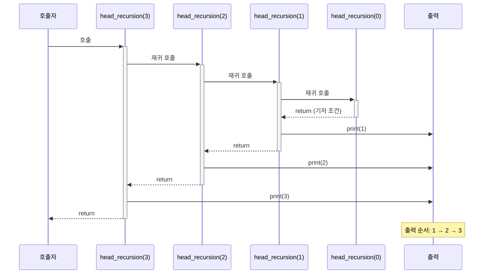
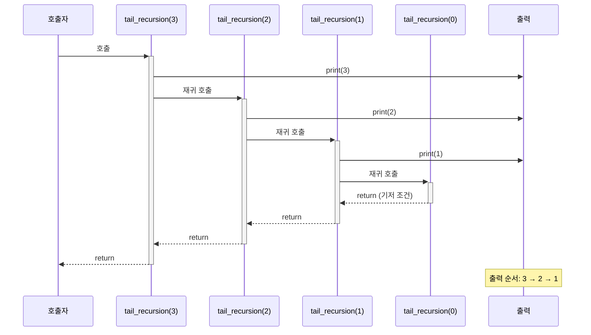

# Head Recursion vs Tail Recursion 가이드

재귀함수를 작성할 때 **언제** 작업을 수행하느냐에 따라 두 가지 패턴으로 나눌 수 있습니다.

## 🔤 용어 정의

### Head Recursion (머리 재귀)
- **재귀 호출이 먼저**, **작업은 나중에**
- 재귀 호출 후 돌아와서 작업을 수행
- 결과: 작은 값부터 큰 값 순서 (오름차순)

### Tail Recursion (꼬리 재귀)  
- **작업이 먼저**, **재귀 호출은 나중에**
- 재귀 호출하기 전에 작업을 수행
- 결과: 큰 값부터 작은 값 순서 (내림차순)

## 📝 예시 코드

### Head Recursion 예시
```python
def head_recursion(n):
    if n > 0:
        head_recursion(n - 1)  # 재귀 호출 먼저
        print(n)               # 작업은 나중에

# 호출: head_recursion(5)
# 출력: 1 2 3 4 5 (오름차순)
```

### Tail Recursion 예시
```python
def tail_recursion(n):
    if n > 0:
        print(n)               # 작업 먼저
        tail_recursion(n - 1)  # 재귀 호출은 나중에

# 호출: tail_recursion(5)
# 출력: 5 4 3 2 1 (내림차순)
```

## 🔍 실행 과정 분석

### Head Recursion 실행 과정



**특징:** 재귀 호출을 **먼저** 하고, **돌아와서** 작업 수행  
**결과:** `1 2 3` (오름차순)

### Tail Recursion 실행 과정



**특징:** 작업을 **먼저** 수행하고, **나중에** 재귀 호출  
**결과:** `3 2 1` (내림차순)

## 🎯 언제 사용할까?

### Head Recursion을 사용하는 경우
- **거꾸로 처리**해야 할 때
- 작은 것부터 큰 것 순서로 출력하고 싶을 때
- 예: 숫자를 역순으로 뒤집기, 문자열 뒤집기

### Tail Recursion을 사용하는 경우  
- **순서대로 처리**하면 될 때
- 큰 것부터 작은 것 순서로 출력하고 싶을 때
- 예: 카운트다운, 계단식 출력

## 💡 기억하기 쉬운 팁

- **Head** = 머리 = 위쪽 = 재귀 호출이 **위에** → **작업은 아래에**
- **Tail** = 꼬리 = 아래쪽 = 재귀 호출이 **아래에** → **작업은 위에**

## 🌟 추가 예시

### 별표 패턴 출력
```python
# Head Recursion - 작은 것부터 큰 것
def star_head(n):
    if n > 0:
        star_head(n - 1)
        print('*' * n)

# star_head(3) 출력:
# *
# **  
# ***

# Tail Recursion - 큰 것부터 작은 것
def star_tail(n):
    if n > 0:
        print('*' * n)
        star_tail(n - 1)

# star_tail(3) 출력:
# ***
# **
# *
```

이렇게 재귀 호출과 작업의 순서만 바꿔도 완전히 다른 결과를 얻을 수 있습니다! 🎉